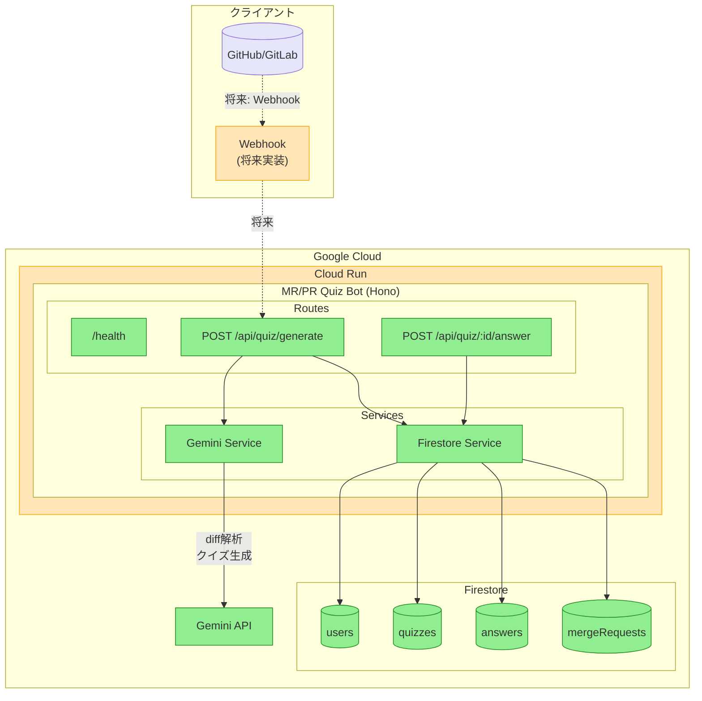
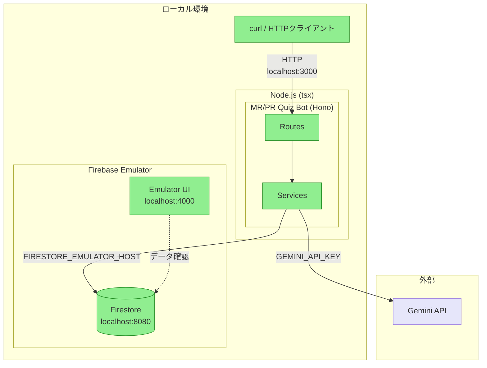
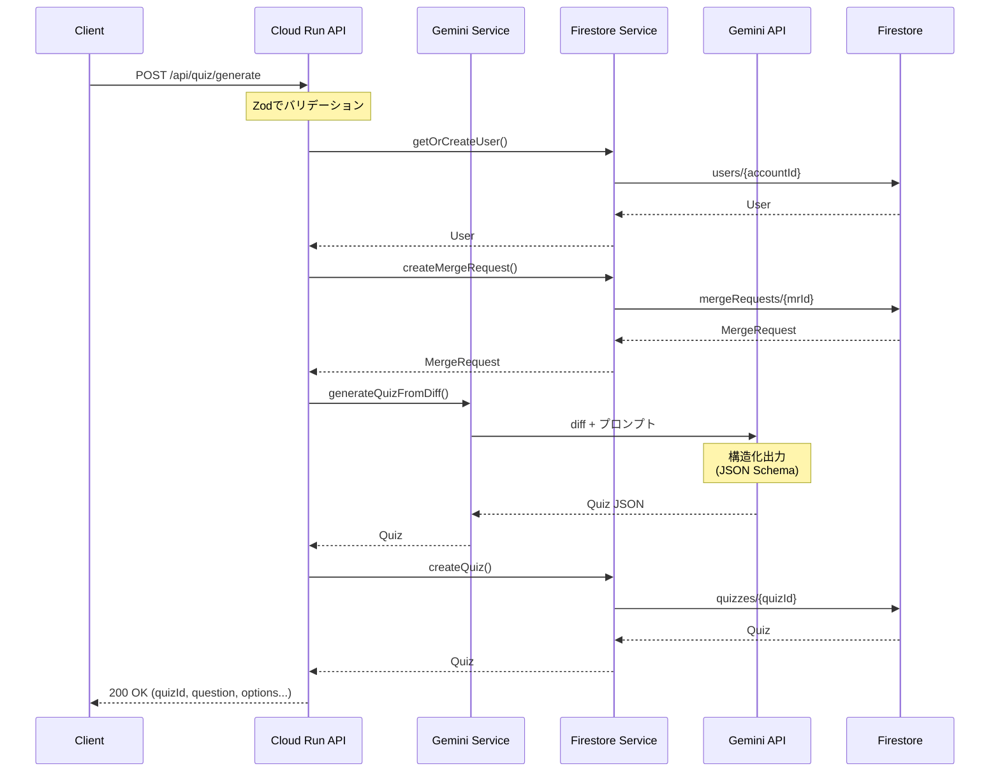
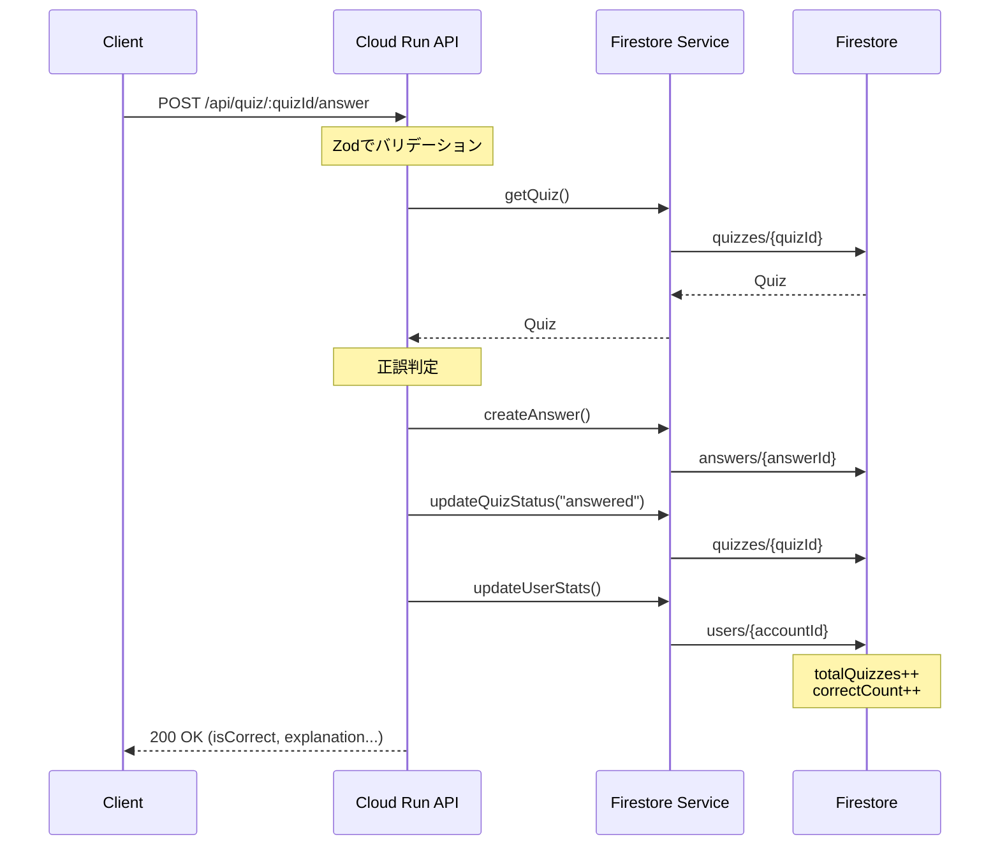
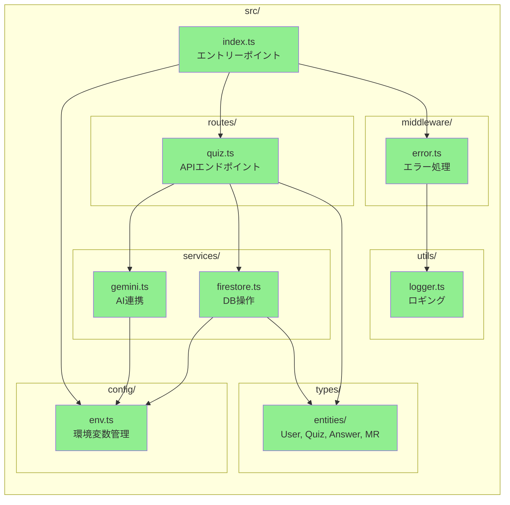
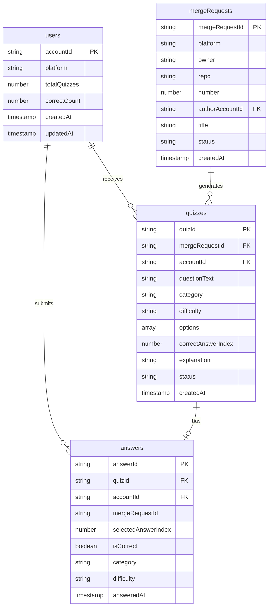
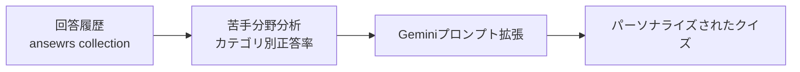

# MR/PR Quiz Bot - アーキテクチャ図

## 本番構成（Google Cloud）

### 凡例

| 色 | 意味 |
|----|------|
| 🟢 緑 | 実装済み |
| 🟠 オレンジ | 将来実装予定 |
| 🟣 紫 | 外部システム（GitHub/GitLab） |

---

## ローカル開発構成

---

## データフロー図

### クイズ生成フロー

### クイズ回答フロー

---

## コンポーネント構成

---

## Firestoreコレクション構成

---

## 実装状況サマリ

| フェーズ | 機能 | 状態 |
|---------|------|------|
| Phase 1 | プロジェクトセットアップ | ✅ 完了 |
| Phase 2 | コアインフラ（型定義、ロガー、エラーハンドリング） | ✅ 完了 |
| Phase 3 | US1: クイズ生成・回答（MVP） | ✅ 完了 |
| Phase 4 | US2: パーソナライズ出題 | 📋 予定 |
| Phase 5 | US3: データ可視化 | 📋 予定 |
| Phase 6 | US4: スキップ・リマインド | 📋 予定 |
| Phase 7 | 本番デプロイ（Cloud Run） | 📋 予定 |

---

## 設計メモ

### パーソナライズ機能の実装方針

クイズのパーソナライズ（苦手分野の重点出題）は、**プロンプトベース**で実装する。

#### 検討した選択肢

| アプローチ | 採用 | 理由 |
|-----------|:----:|------|
| プロンプト調整 | ✅ | シンプル、低コスト、即実装可能 |
| Vertex AI Fine-tuning | ❌ | データ量不足、コスト高、ハッカソン期間に不適 |

#### 将来の検討事項

- ユーザーデータが数千〜数万件に達した場合、Fine-tuningを再検討
- より複雑なパーソナライズパターンが必要になった場合に移行を検討
